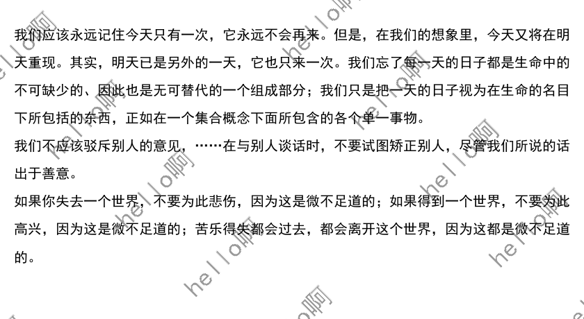

# TextToImage
- 文字转化为图片
- 可以转换为长图或根据图片大小转换为多图
- 添加文字水印
- `simhei.ttf` 为中文字库文件
- `a.txt` 为测试的文字文件

## 文字转换为长图

text2piiic(string, length, fontsize=20, x=20, y=40, spacing=20)

string: 需要转换的文字

length：图片一行的文字个数

fontsize：字体大小

x：文字的起始位置

y：文字的起始位置

spacing：文字行间距

cut: 不满lenght个文字是否切除右侧空白，默认为False

return：生成的长图,`PIL` 模块的 `Image` 类型
## 文字根据图片转换为多图

text2multigraph(string, backdrop, fontsize=20, x=20, y=40, spacing=20)

string: 需要转换的文字

backdrop：背景图片，`PIL` 模块的 `Image` 类型

fontsize：字体大小

x：文字的起始位置

y：文字的起始位置

spacing：文字行间距

return：生成的长图列表,`PIL` 模块的 `Image` 类型

## 添加文字水印
- 添加单个水印

add_single_watermark(image, text, font, alpha=100, position='middle')

image: 图片

text: 文字

font: 字体

alpha: 透明度，0-255

position: 水印位置，为middle、topleft或者bottomright中的一个

return: 带水印的图片(PIL.Image)
- 添加整体水印

add_watermark(image, text, font, alpha=100, space=100)

image: 图片

text: 文字

font: 字体

alpha: 透明度，0-255

space: 间隔

return: 带水印的图片(PIL.Image)
